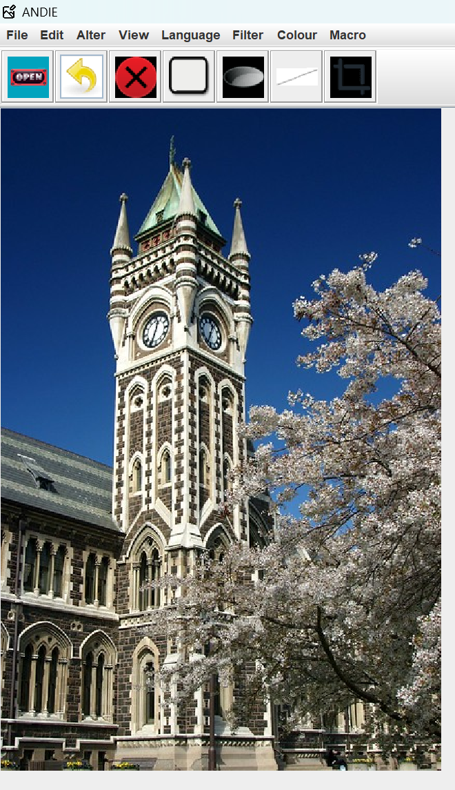

# ANDIE (A Non-Destructive Image Editor)

ANDIE is a Java-based non-destructive image editor developed as part of a group project for COSC202 at the University of Otago. The program allows for various image manipulation operations while preserving the original image data through a non-destructive editing approach.


*Example of ANDIE interface showing image manipulation capabilities*

## About

ANDIE takes a non-destructive approach to image editing, meaning that instead of directly modifying the image data, it stores the original image and maintains a sequence of operations. This allows for easy undoing of operations and ensures no information is lost during the editing process.

## Features

### Core Functionality
- Open, save, and export images in various formats
- Undo/Redo support for all operations
- Zoom controls (in, out, full)
- Multilingual support (English and Spanish)
- Keyboard shortcuts for all operations
- Toolbar for quick access to common operations

### Image Manipulation
- **Filters**
  - Mean Filter
  - Gaussian Blur
  - Soft Blur
  - Median Filter
  - Sharpen Filter
  - Emboss Filter
  - Sobel Edge Detection
  - Block Averaging
  - Random Scatter Effect
  - Extended edge handling for all filters

- **Color Operations**
  - Grayscale Conversion
  - Color Channel Cycling
  - Color Inversion
  - Brightness/Contrast Adjustment
  - Warmth Adjustment
  - Vibrance Control

- **Transform Operations**
  - Rotate (90° left, 90° right, 180°)
  - Flip (Horizontal and Vertical)
  - Resize (up to 1500x1500 pixels)
  - Crop to Selection

- **Advanced Features**
  - Mouse-based Region Selection
  - Drawing Tools
  - Macro Recording and Playback
  - Region-based Operations

## Getting Started

### Prerequisites
- Java Development Kit (JDK) 11 or higher
- Gradle Build Tool

### Building and Running the Application
1. Clone the repository
2. Navigate to the project directory
3. Build the project using Gradle:
   ```bash
   ./gradlew build
   ```
4. Run the application:
   ```bash
   ./gradlew run
   ```

Note: On Windows, use `gradlew.bat` instead of `./gradlew`

To clean the build (if needed):
```bash
./gradlew clean
```

For development in an IDE:
1. Import as a Gradle project
2. Gradle will automatically download dependencies and configure the project
3. Run the main class: `cosc202.andie.ANDIE`

## Usage Guide

### Basic Operations
1. **File Operations** (File menu)
   - Open: Load an image file
   - Save/Save As: Save current image
   - Export: Export the edited image

2. **Edit Operations** (Edit menu)
   - Undo: Revert last operation
   - Redo: Reapply reverted operation

3. **View Controls** (View menu)
   - Zoom In/Out
   - Zoom Full
   - Region Selection

4. **Image Transformations** (Alter menu)
   - Rotate image
   - Flip image
   - Resize image

### Applying Filters and Effects
Access filters through the Filter menu:
- Select desired filter
- Adjust parameters if prompted
- Preview changes
- Apply filter

### Using Macros
1. Start recording (Macro → Record)
2. Perform desired operations
3. Stop recording (Macro → Stop)
4. Replay recorded operations (Macro → Reload)

## Known Issues
1. Export shortcut (Alt-E) requires double-press on MacOS
2. Macro playback may fail if region selections exceed target image bounds
3. Median filter has slower performance compared to other filters

## Development Team

### Part 1 Contributors
- Noah Parkes: Gaussian blur, Image flip
- Maiek Anantawat: Color channel cycle, Error prevention
- Damian Fraser: Alter actions menu, Image rotation, Color inversion
- Jan Faller: Median filter, Export function
- Parsa Orodes: Multilingual support, Sharpen filter, Resize, Soft blur, Testing

### Part 2 Contributors
- Noah Parkes: Extended filters, Brightness/Contrast adjustments
- Maiek Anantawat: Keyboard shortcuts, Region selection, UI enhancements
- Damian Fraser: Random scatter, Toolbar implementation, Crop function
- Jan Faller: Negative filter results, Drawing functions, Macro system
- Parsa Orodes: Emboss/Edge detection, Block averaging, Region selection

## Acknowledgments
- University of Otago COSC202 course staff
- Original ANDIE boilerplate code developers